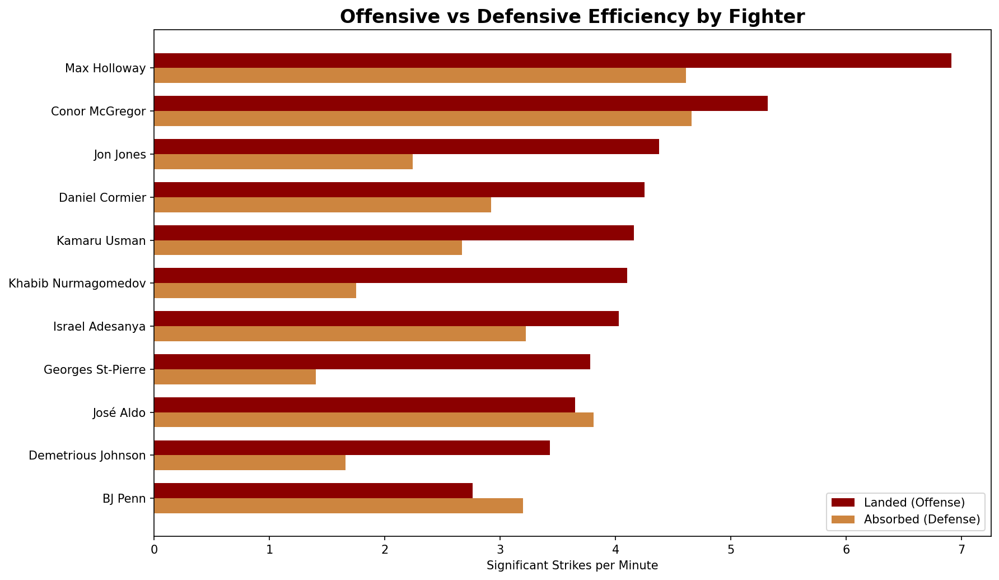

# 🥊 UFC Data Engineering Pipeline

> An end-to-end Python data engineering pipeline that extracts, transforms, loads, and visualizes UFC fighter statistics using the UFC API via RapidAPI.

---

## 📊 Sample Output



*Significant strikes landed vs absorbed per minute — revealing each fighter's offensive and defensive efficiency*

---

## 📌 Overview

Built out of a lifelong passion for martial arts, this project demonstrates a full ETL pipeline integrating UFC API data to create structured datasets and meaningful performance insights.

**Key skills demonstrated:** API ingestion, ETL pipeline design, data cleaning, analytical modeling, and data visualization.

---

## ⚙️ Architecture

```
UFC API → Extract → Transform → Load (CSV) → Visualize (Matplotlib/Seaborn)
```

---

## 🚀 Features

- Extracts live fighter statistics from the UFC API (RapidAPI)
- Cleans and normalizes raw fighter data with Pandas
- Loads structured data into CSV format
- Generates offensive vs defensive efficiency visualization (strikes landed vs absorbed per minute)
- Modular ETL design — each stage is independently maintainable
- Fighter list managed via centralized config

---

## 🛠️ Tech Stack

- Python
- Pandas
- Requests
- Matplotlib
- Seaborn
- python-dotenv

---

## 📁 Project Structure

```
ufc-data-engineering-pipeline/
├── src/
│   ├── main.py
│   ├── config/
│   │   └── settings.py
│   ├── extract/
│   │   └── fighter_api.py
│   ├── transform/
│   │   └── normalize.py
│   └── load/
│       └── csv_loader.py
├── data/
│   └── processed/
├── images/
│   └── ufc_viz.png
├── .gitignore
├── requirements.txt
└── README.md
```

---

## 🔐 Environment Variables

Create a `.env` file in the root directory:

```
RAPIDAPI_KEY=your_key_here
RAPIDAPI_HOST=ufc-api5.p.rapidapi.com
```

Do **not** commit your `.env` file to GitHub.

---

## ▶️ How to Run

```bash
git clone https://github.com/jeffreyjblee/ufc-data_engineering-pipeline.git
cd ufc-data-engineering-pipeline
pip install -r requirements.txt
python src/main.py
```

---

## 💡 Sample Insights

- **Khabib Nurmagomedov** has the best offensive/defensive efficiency ratio — high strikes landed with very low absorption
- **Max Holloway** is the highest volume striker on the list but also absorbs significant punishment — classic pressure fighter
- **Georges St-Pierre** shows the largest gap between offense and defense, landing nearly 3x more strikes than he absorbs

---

## ⚠️ Disclaimer

This project is for educational purposes only and is not affiliated with or endorsed by the UFC.

---

**👤 Author:** Jeffrey Lee